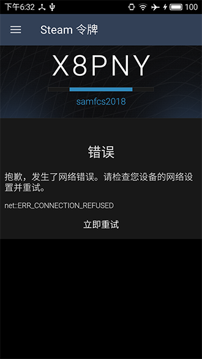

# Steam Authentication Code Parser

> Simple scripts to read steam authentication code, then process and parse the result. It just for fun, if you want to retrieve the authentication code properly, please search steam 2FA code generation.

## How to try it
Please clone and install(npm).

## Parse steps
1. ### Take screen capture from app using adb.
```js
const Authenticator = require('index.js')
let options = {
  adbPath: '...', //optional, if adb not in $PATH can explicit specify it
}
let auth = new Authenticator(options)
auth.saveCapture()
```

2. ### Crop and normalize the authentication code.
```js
await auth.cropCapture() // async function
auth.cropCapture().then(...) // or promise
```

3. ### Parse the code from the picture from step2.
```js
auth.parseCodeWithOcrad() // use Ocrad.js
auth.parseCodeWithTesseract() // or Tessera
```
Result:
```
X8PNY
```
## Remark 
To enhance the match rate, you can train the Tesseract framework and update the trainned data.  

## Dependency
1. adb
2. Tesseract
3. Ocrad.js 